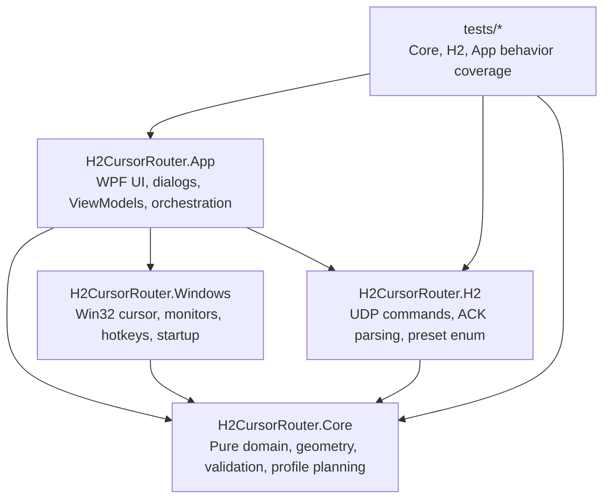
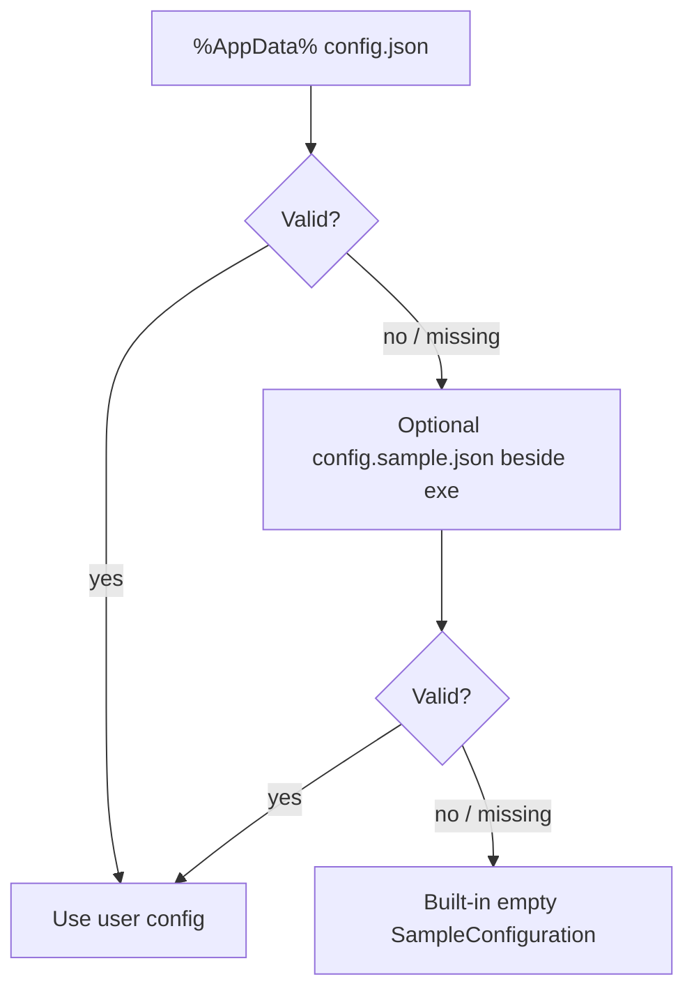
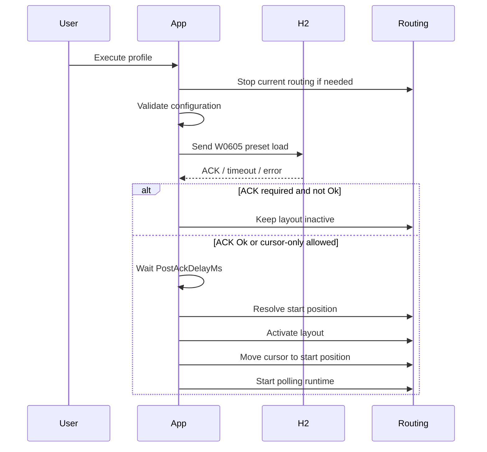
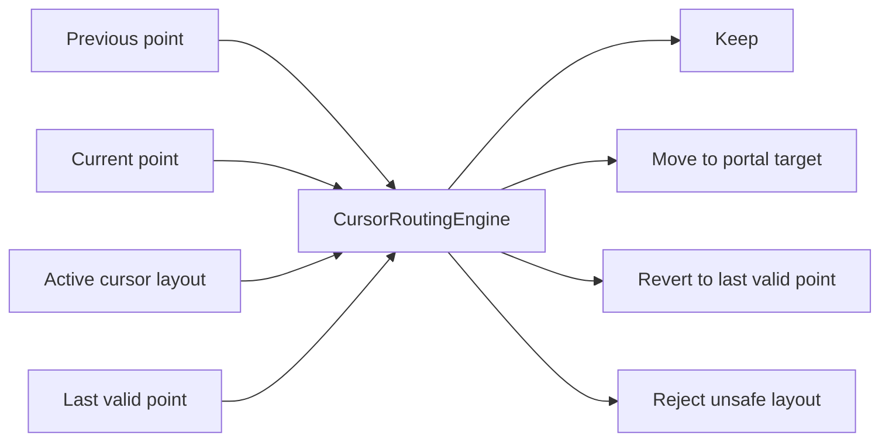
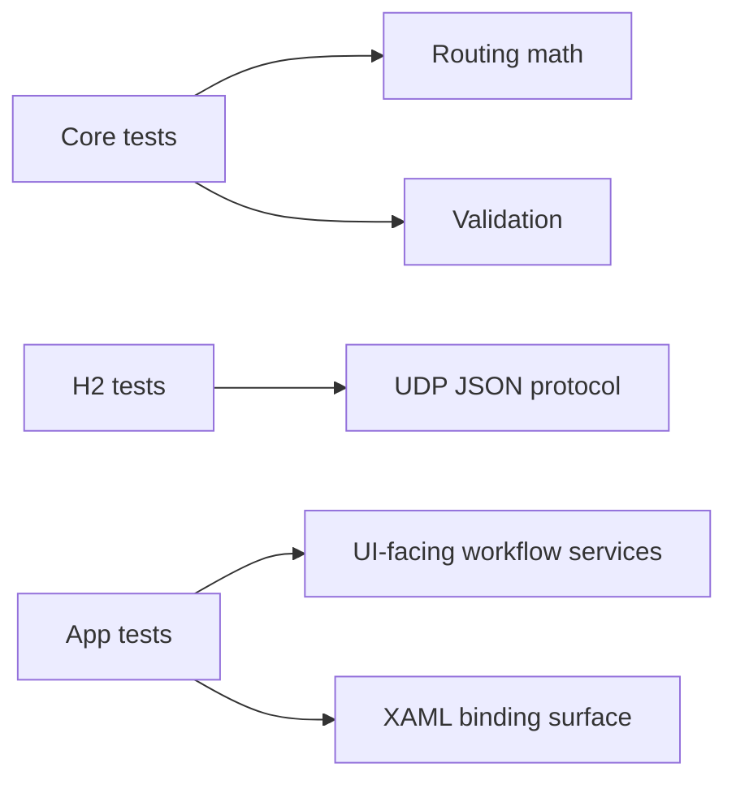

# vp-cursor-portal Development Notes

This document keeps the development-oriented material that used to live in the README. The README is now focused on release, install, and product usage; this file covers architecture, runtime behavior, test expectations, publishing, and release process.

## At A Glance

| Area | Current decision |
|---|---|
| Product name | `vp-cursor-portal` |
| Target OS | Windows x64 |
| UI | WPF desktop app |
| Runtime | C# / .NET 10 |
| Target device | NovaStar H Series / H2 |
| Device protocol | UDP JSON |
| Cursor model | Polling-based Win32 cursor routing |
| Packaging | Portable ZIP and Inno Setup installer from GitHub Actions |
| Config path | `%AppData%\vp-cursor-portal\config.json` |
| Safety baseline | Routing starts disabled, emergency unlock is always available |

## Current MVP Status

`v0.1.4` is prepared from `main`.

| Status | Capability |
|---|---|
| Done | WPF desktop app targeting `.NET 10` / `net10.0-windows` |
| Done | Separated Core, H2, Windows, App, and test projects |
| Done | H2 `W0605` preset load and `R0600` preset enum commands |
| Done | UDP timeout handling and one in-flight H2 command at a time |
| Done | ACK parsing for success, failure, malformed JSON, and unexpected responses |
| Done | Pure cursor routing engine for visible, hidden, outside, portal-only visible-zone transitions, full-edge, segmented, and different-size visual mapping cases |
| Done | Polling-based Win32 cursor routing runtime |
| Done | Emergency unlock hotkey and UI action |
| Done | Monitor topology detection and topology-change safety shutdown |
| Done | Dashboard-first WPF workflow for profiles, H2 status, routing status, emergency unlock, layout editing, diagnostics, and logs |
| Done | Layout editor with detected coordinates, scaled canvas, drag/resize, snapping, and auto portal generation |
| Done | Profile execution for H2-only, cursor-layout-only, or combined actions |
| Done | Portable ZIP and installer artifact generation through GitHub Actions |
| Deferred | X100 Pro support |
| Deferred | Generic TCP/UDP HEX console |
| Deferred | HTTP API / Stream Deck integration |
| Deferred | Low-level mouse hook mode |
| Deferred | Auto-discovery of the H2 visual layout from the processor |
| Deferred | Signed installer |

## Repository Layout

The repository name and product name are `vp-cursor-portal`. The solution and C# project names still use `H2CursorRouter.*` because they were created before the final product name was settled.

```text
H2CursorRouter.sln
README.md
LICENSE

.github/workflows/
  windows-build.yml

docs/
  development.md

docs/releases/
  v0.1.0.md
  v0.1.1.md
  v0.1.2.md
  v0.1.3.md
  v0.1.4.md

installer/inno/
  vp-cursor-portal.iss

scripts/
  publish-windows.ps1

src/
  H2CursorRouter.Core/
  H2CursorRouter.H2/
  H2CursorRouter.Windows/
  H2CursorRouter.App/

tests/
  H2CursorRouter.Core.Tests/
  H2CursorRouter.H2.Tests/
  H2CursorRouter.App.Tests/
```

Files intentionally not tracked:

- `AGENTS.md` - local agent/developer operating notes.
- `config.sample.json` - local-only sample or field-test config, if needed.
- `.gitkeep` - local placeholder files.
- runtime `config.json`, logs, and build artifacts.

The app no longer requires a tracked `config.sample.json`. On a clean install it uses the built-in empty configuration from `SampleConfiguration.Create()`.

## Project Responsibilities



| Project | Owns | Must avoid |
|---|---|---|
| `H2CursorRouter.Core` | Domain models, geometry, routing decisions, validation, profile planning | WPF, Win32, sockets, real hardware |
| `H2CursorRouter.H2` | NovaStar H2 UDP JSON commands and responses | UI state and cursor movement |
| `H2CursorRouter.Windows` | Win32 cursor, monitor topology, hotkeys, startup registration | Business rules that belong in Core |
| `H2CursorRouter.App` | WPF shell, composition, ViewModels, dialogs, user workflows | Geometry decisions that cannot be tested outside the UI |
| `tests/*` | Behavior coverage around routing, H2, mapping, XAML bindings, log policy | Real H2 devices or real cursor movement |

### `H2CursorRouter.Core`

Pure domain, geometry, profile, and validation logic. This project must not depend on WPF, Win32, sockets, or real hardware.

Important folders and types:

- `Domain/`
  - `H2DeviceConfig`
  - `H2PresetRef`
- `Geometry/`
  - `CursorLayout`
  - `CursorZone`
  - `CursorPortal`
  - `CursorRoutingEngine`
  - `RoutingDecision`
- `Profiles/`
  - `ExecutionProfile`
  - `ProfileExecutionPlanner`
- `Validation/`
  - `AppConfigurationValidator`
  - `CursorLayoutValidator`
- `Configuration/`
  - runtime config models and JSON document mapping

Rule: add or update Core tests whenever cursor routing math, validation rules, profile planning, or config contracts change.

### `H2CursorRouter.H2`

NovaStar H Series / H2 UDP JSON communication.

Important types:

- `H2CommandBuilder` builds JSON commands:
  - `W0605` load preset
  - `R0600` get preset enum
- `H2ResponseParser` parses ACK responses.
- `H2PresetEnumParser` parses preset lists.
- `H2DeviceClient` sends UDP commands and serializes command execution.
- `IH2DeviceClient` is the app/test boundary.

Current H2 assumptions:

- UDP transport.
- Default H2 port `6000`.
- `ack:"Ok"` means success.
- `ack:"Error"`, missing ACK, timeout, malformed JSON, or unexpected command means failure.
- ACK comparison is case-insensitive and trimmed.

Rule: do not apply a cursor layout after H2 failure when the profile requires ACK.

### `H2CursorRouter.Windows`

Win32 integration behind interfaces.

Important types:

- `ICursorService` / `Win32CursorService`
- `IMonitorTopologyService` / `Win32MonitorTopologyService`
- `IHotkeyService` / `Win32HotkeyService`
- `IStartupRegistrationService` / `WindowsStartupRegistrationService`
- `ICursorRoutingRuntime` / `CursorRoutingRuntime`

The runtime:

- starts disabled,
- polls cursor position,
- evaluates the active layout through the pure `CursorRoutingEngine`,
- moves the cursor with `SetCursorPos`,
- clips the cursor only for single-visible-zone layouts,
- releases clipping on stop, topology change, emergency unlock, and app exit.

Rule: Win32 calls stay in this project. Core logic stays pure and testable.

### `H2CursorRouter.App`

WPF shell, app composition, row view models, dialogs, execution orchestration, and UI-facing services.

Important files:

- `App.xaml.cs`
  - creates Win32/H2 services,
  - loads user config,
  - wires `MainViewModel`,
  - starts monitor topology watching.
- `MainWindow.xaml`
  - dashboard-first WPF UI.
- `MainWindow.xaml.cs`
  - hotkey registration, tray behavior, event handlers.
- `ViewModels/MainViewModel.cs`
  - root facade/coordinator for UI bindings.
- `ViewModels/DevicePresetViewModel.cs`
  - H2 device rows, preset cache rows, preset fetch, H2 status.
- `ViewModels/LayoutEditorViewModel.cs`
  - layout, zone, portal, monitor, and canvas state.
- `ViewModels/ProfileListViewModel.cs`
  - profile add/edit/remove/filter/dashboard list.
- `ViewModels/RuntimeLogViewModel.cs`
  - runtime status, last routing event, visible log list, validation messages.
- `Services/ProfileExecutionService.cs`
  - profile execution workflow.
- `Services/ConfigurationCoordinator.cs`
  - row-to-config build, validation, and save coordination.
- `Services/ConfigurationRowMapper.cs`
  - converts runtime config to UI rows and back.
- `Services/LayoutEditingService.cs`
  - canvas move/resize/snap helpers.
- `Services/MonitorZoneMatcher.cs`
  - maps UI zones to detected monitor coordinates.
- `Assets/`
  - Windows app icon, tray icon, and icon source artwork.

`MainViewModel` intentionally remains a facade for existing WPF bindings. New behavior should usually go into a child ViewModel or service first, then be exposed through the facade only when the XAML needs it.

## Runtime Configuration

Runtime data is per-user:

```text
%AppData%\vp-cursor-portal\config.json
%AppData%\vp-cursor-portal\logs\
```

Configuration load order:



1. `%AppData%\vp-cursor-portal\config.json`
2. optional `config.sample.json` beside the executable, if a developer or tester manually placed one there
3. built-in empty configuration from `SampleConfiguration.Create()`

Invalid config files are moved aside with an `.invalid-{timestamp}` suffix and the app falls back to the next source.

Clean install behavior:

- no H2 devices,
- no cursor layouts,
- no profiles,
- routing disabled.

The app writes `config.json` only when save or auto-save succeeds. ZIP replacement or installer upgrade should not overwrite existing user config.

## Profile Execution Flow

A profile can reference:

| Profile binding | Behavior |
|---|---|
| H2 preset only | Send preset command, update H2 status, do not change cursor routing |
| Cursor layout only | Activate cursor layout and routing without H2 communication |
| H2 preset + cursor layout | Load preset first, then apply cursor layout if ACK policy allows it |

For a profile with both H2 preset and cursor layout:



The UI shows the active profile/layout, H2 status, routing state, last routing event, and logs.

## Cursor Routing Model

A cursor layout contains:

| Concept | Meaning |
|---|---|
| Visible zone | Monitor/source area that is visible in the active H2 layout |
| Hidden zone | Windows monitor area that should not accept cursor travel for the active layout |
| Windows rectangle | Real virtual-screen coordinates from Windows |
| Visual rectangle | Where that source appears in the H2 output layout |
| Portal edge | Ratio-based mapping from one zone edge segment to another |
| Default start position | Safe fallback cursor position when a profile does not specify one |



The routing engine is pure. It receives the active layout, previous cursor position, current cursor position, and last valid cursor position. It returns a `RoutingDecision`:

- keep current position,
- move to mapped portal target,
- revert to last valid position,
- reject unsafe layout.

Portal mapping uses visual-ratio mapping rather than copying raw pixels. This lets a large visual source map correctly to a smaller or segmented target source.

When the cursor moves from one visible zone into another visible zone, the transition must match a configured portal. If no portal matches, the engine reverts to the last valid position instead of allowing Windows' native monitor adjacency to decide the destination.

High-risk behavior:

- hidden monitor handling,
- non-portal visible-zone transition rejection,
- virtual desktop boundary crossings,
- segmented edge portals,
- single-visible-zone clipping,
- topology-change shutdown.

Any change in these areas should include focused Core or Windows/App tests.

## Logging Policy

Logs are meant for field diagnosis, not raw cursor tracing.

Logged:

- app startup and recovery warnings,
- H2 command failures and important H2 successes,
- profile execution start and routing start/failure,
- emergency unlock,
- topology changes,
- config validation/save failures,
- layout/profile/device changes.

Not accumulated in the visible log list or log files:

- high-frequency `Portal move` diagnostics,
- high-frequency `Cursor revert` diagnostics,
- repeated identical display-detection results,
- successful auto-save noise,
- successful raw H2 ACK JSON.

High-frequency routing diagnostics still update `LastRoutingEvent` so the dashboard can show the latest movement/revert without flooding the log.

Visible UI logs are capped at 300 entries. File logs are written under AppData and files older than 30 days are deleted on startup.

## Safety Requirements

Safety is mandatory.

- Routing starts disabled.
- Emergency unlock hotkey: `Ctrl+Alt+Shift+Esc`.
- Emergency unlock button is available in the UI.
- Emergency unlock disables routing, releases cursor clipping, clears active layout, and logs the event.
- App exit releases routing and clipping.
- Monitor topology changes disable routing.
- Invalid layouts are refused.
- H2 failure prevents cursor-layout activation when ACK is required.

Do not remove or hide emergency controls from normal operation paths.

## Build, Test, Run

| Task | Command |
|---|---|
| Restore | `dotnet restore H2CursorRouter.sln` |
| Build | `dotnet build H2CursorRouter.sln` |
| Test | `dotnet test H2CursorRouter.sln` |
| Run WPF app | `dotnet run --project src\H2CursorRouter.App\H2CursorRouter.App.csproj` |

Windows command block:

```powershell
dotnet restore H2CursorRouter.sln
dotnet build H2CursorRouter.sln
dotnet test H2CursorRouter.sln
dotnet run --project src\H2CursorRouter.App\H2CursorRouter.App.csproj
```

On non-Windows machines, the WPF app may not build or run. Validate cross-platform logic directly:

```bash
dotnet test tests/H2CursorRouter.Core.Tests/H2CursorRouter.Core.Tests.csproj
dotnet test tests/H2CursorRouter.H2.Tests/H2CursorRouter.H2.Tests.csproj
```

Do not downgrade the target framework from .NET 10 to make a local machine pass.

## Publishing

| Output | Command | Path |
|---|---|---|
| Portable app folder | `.\scripts\publish-windows.ps1` | `artifacts\vp-cursor-portal-win-x64\` |
| Installer | `.\scripts\publish-windows.ps1 -BuildInstaller` | `artifacts\installer\vp-cursor-portal-setup.exe` |

Local Windows publish:

```powershell
.\scripts\publish-windows.ps1
```

Output:

```text
artifacts\vp-cursor-portal-win-x64\
```

Run:

```text
artifacts\vp-cursor-portal-win-x64\vp-cursor-portal.exe
```

Local installer build:

```powershell
.\scripts\publish-windows.ps1 -BuildInstaller
```

Output:

```text
artifacts\installer\vp-cursor-portal-setup.exe
```

The installer:

- installs under `Program Files`,
- creates a Start Menu shortcut,
- optionally creates a desktop shortcut,
- asks during uninstall whether to delete `%AppData%\vp-cursor-portal`.

## GitHub Actions Artifacts

Workflow: `.github/workflows/windows-build.yml`

| Trigger | Result |
|---|---|
| Push to `main` or `master` | Build, test, publish ZIP and installer artifacts |
| Pull request | Build, test, publish artifacts for review |
| Manual dispatch | On-demand build |
| Version tag matching `v*` | Build, test, publish artifacts, and upload GitHub Release assets |

The workflow:

1. installs .NET 10,
2. restores,
3. builds,
4. tests,
5. publishes a self-contained Windows x64 app,
6. builds the Inno Setup installer,
7. uploads artifacts.

| Artifact | Contains |
|---|---|
| `vp-cursor-portal-win-x64` | Portable self-contained app folder |
| `vp-cursor-portal-setup` | Program Files installer |

GitHub Release assets are uploaded only for tags like `v0.1.4`.

## Release Checklist

`v0.1.4` is prepared. Use this checklist to publish and verify the release:

1. Merge the PR branch.
2. Confirm the latest `Windows Build` workflow passes.
3. Download and run the installer artifact on a Windows test PC.
4. Confirm install path, Start Menu shortcut, app launch, and uninstall behavior.
5. Test emergency unlock before routing field tests.
6. Confirm existing `%AppData%\vp-cursor-portal\config.json` behavior: keep, migrate, or delete intentionally.
7. Create and push a version tag, for example:

```bash
git tag v0.1.4
git push origin v0.1.4
```

The tag workflow creates release assets.

For version tags, the release body is read from `docs/releases/<tag>.md`, for example `docs/releases/v0.1.4.md`.

## Code Signing And SmartScreen

The MVP installer is not code-signed yet. Microsoft Defender SmartScreen may show an unknown publisher warning when users run the installer or executable.

Code signing requires a certificate from a trusted certificate authority. The project can support signing in the build pipeline after a certificate is available, but the certificate purchase, identity verification, and secret storage must be handled by the project owner.

Recommended path:

| Stage | Action |
|---|---|
| MVP / field test | Keep unsigned artifacts and mention the SmartScreen warning in release notes |
| Public release | Buy an OV or EV code signing certificate |
| CI integration | Store signing certificate/password as GitHub Actions secrets |
| Installer build | Sign the app executable and installer during the Windows workflow |

EV certificates usually reduce SmartScreen friction faster, but they cost more and require stricter verification. OV certificates are more common for small projects, but reputation may take time to build.

## Development Guidelines

Use this order when changing behavior:

1. Add or update tests in Core/H2/App as close to the behavior as possible.
2. Change pure logic first when possible.
3. Keep Win32 and WPF integration behind interfaces.
4. Keep `MainViewModel` as a facade; place new responsibility in a child ViewModel or service.
5. Preserve safety behavior before visual polish.
6. Run `dotnet test H2CursorRouter.sln` on Windows or rely on GitHub Actions if local OS lacks WPF support.

Avoid:

- real H2 or real cursor movement in automated tests,
- UI-only validation for routing math,
- applying cursor layouts after failed H2 ACK when ACK is required,
- replacing existing user config during install/update,
- logging high-frequency cursor movement into files.

## Test Coverage Map

| Test project | Primary coverage |
|---|---|
| `H2CursorRouter.Core.Tests` | Cursor routing decisions, hidden/outside-zone rejection, portal selection, full-edge and segmented mapping, validation, profile planning |
| `H2CursorRouter.H2.Tests` | Command serialization, ACK parsing, malformed responses, fake UDP integration cases |
| `H2CursorRouter.App.Tests` | Row/config mapping, profile execution service, layout editing helpers, monitor-zone matching, XAML binding surface, log retention/noise policy, MainViewModel facade behavior |



## License, Notices, And About Tab

`vp-cursor-portal` is released as open-source software under the MIT License. See [LICENSE](../LICENSE).

The app includes an About tab below Advanced. It currently shows:

- product name: `vp-cursor-portal`,
- app version,
- MIT license summary,
- config/log path,
- app icon.

Before a broader public release, consider adding publisher/company name, support/contact details, and a third-party notices link or bundled notice file.

The project currently uses the .NET runtime, WPF/WinForms platform libraries, GitHub Actions, and Inno Setup for installer generation. Review their license requirements before a formal public release.
